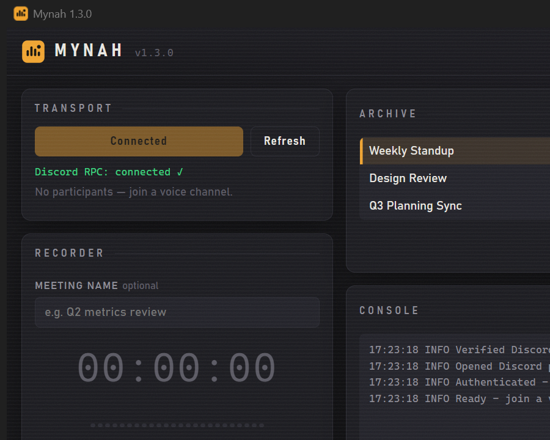

# Mynah

> **Record Discord voice calls and transcribe them locally with accurate per-speaker labels — no bot, nothing leaves your machine.**



### Why Mynah

- **100% local.** Audio capture, transcription, and storage all happen on your machine. No cloud upload, no bot, no third-party service ever sees your call.
- **No bot joins the channel.** Mynah talks to your local Discord desktop client over a named pipe (the same one Spotify uses for "Listening to…"). Other participants see nothing.
- **Ground-truth speaker labels.** Mynah subscribes to Discord's own per-user `SPEAKING_START` / `SPEAKING_STOP` events — so transcript labels are correct by definition, not by acoustic clustering. Heuristic diarization is the fallback, not the default.

---

## Quick start (TL;DR)

### Just want the app? One-click installer

Download **`MynahSetup.exe`** from the
[latest release](https://github.com/ba1lly/Mynah/releases/latest) and run
it. No Python, Git, or PowerShell needed.

- The installer itself is ~11 MB. On first run it downloads the ML stack
  into `%LOCALAPPDATA%\Mynah` — ~2.5 GB with an NVIDIA GPU (it detects
  your driver and picks CUDA or CPU builds automatically), less for
  CPU-only.
- If the connection drops mid-install, just run it again — it resumes
  from the last completed step (the Python-runtime download also
  resumes mid-file; packages that already installed aren't
  re-downloaded).
- You get a Start Menu entry (and optional Desktop shortcut), and the
  install registers in Windows **Settings → Apps → Installed apps** —
  uninstall it from there like any other app (it asks whether to keep
  your recordings and settings).

Then do the 2-minute [Discord setup](#discord-setup) below.

### Working on the code? Dev bootstrap

```powershell
# Clone, enter the folder, run the bootstrap. The script creates the venv,
# installs everything that's missing, and launches the app.
git clone https://github.com/ba1lly/Mynah.git
cd Mynah
.\start.ps1
```

Re-run the same command any time you want to launch the app. It's idempotent
— second-time launches skip straight to the GUI in a couple of seconds.

First time only, the script will:

1. Create the `.venv` and install all Python deps (~3 GB of PyTorch + CUDA wheels).
2. Detect if PyTorch is missing, CPU-only, or the wrong version, and self-heal.
3. **Pre-download Whisper model weights** (~1.6 GB) to the Hugging Face cache
   so your first transcription doesn't have to wait. If you've already
   pasted an HF token in Settings, pyannote diarization weights are
   pulled too.

> **Deprecated:** `start.ps1 -Build` (the ~4 GB standalone bundle) is
> superseded by `MynahSetup.exe` above and will be removed in a future
> release ([#17](https://github.com/ba1lly/Mynah/issues/17)). It still
> works for now:
>
> ```powershell
> .\start.ps1 -Build
> ```

---

## Supported applications

Designed and tested for **Discord** voice channels (server channels and
1-on-1 / group DM calls). On Discord, speaker labelling uses **Discord's
own per-user `SPEAKING_START` / `SPEAKING_STOP` events as ground truth**
— we record who Discord says was speaking at each moment, so transcript
labels are correct by definition, not by heuristic.

The recording + transcription pipeline is generic, so other voice apps
technically work too — they just lose the ground-truth labels and fall
back to acoustic diarization:

| App | Audio capture | Speaker labels |
|---|:---:|:---|
| **Discord** (server channels, DMs, group DMs) | ✅ | ✅ ground-truth from Discord `SPEAKING_*` events |
| Zoom / Teams / Meet / Slack Huddles | ✅ | ⚠️ heuristic (pyannote clustering); names anonymous (`SPEAKER_00`, …) unless you edit the mapping JSON |
| Any browser/desktop call | ✅ | ⚠️ same as above |

For non-Discord apps you'd get a clean WAV and a transcript with
`SPEAKER_NN` labels — rename them manually in the `…_mapping.json` file
produced alongside the transcript.

---

## System requirements

| Resource | Minimum | Recommended | Notes |
|---|---|---|---|
| **OS** | Windows 10 1903+ | Windows 11 | WASAPI loopback + named-pipe IPC. No Linux/Mac support. |
| **WebView2 Runtime** | — | — | Renders the UI; preinstalled on Windows 11 and current Windows 10. If it's genuinely missing the app falls back to a basic legacy UI ([download](https://developer.microsoft.com/en-us/microsoft-edge/webview2/)). |
| **CPU** | Any 64-bit, last decade | Modern | The GPU does the heavy lifting during transcription. |
| **RAM** | 8 GB | 16 GB | Whisper `large-v3` peaks around 5 GB. |
| **GPU** | None (CPU works) | NVIDIA RTX 20-series or newer, 6 GB+ VRAM | CPU transcription is ~10× slower than realtime. NVIDIA only (CUDA). |
| **VRAM** | n/a if CPU mode | 3 GB for `large-v3`; less for `medium` / `small` / `base` | Model has to fit. |
| **Disk** | 10 GB free | 15 GB | PyTorch+CUDA (~5 GB), Whisper weights (~3 GB), recordings. |
| **Python** (dev mode) | 3.10 | 3.11, 3.12 or 3.13 | Skip if you're only using the built `.exe`. |
| **NVIDIA driver** | 552+ (mid-2024 or newer) | Latest via GeForce Experience | Required for CUDA 12.6 support. |
| **Network** | First-run only | — | ~3 GB of model + wheel downloads; everything else is local. |

The `.exe` build runs without Python or Git — those are only needed for the
dev launcher.

---

## What you need before first run

| Requirement | How to get it |
|---|---|
| **Python 3.10, 3.11, 3.12, or 3.13** (dev mode only — skip if using the built `.exe`) | <https://www.python.org/downloads/> — tick **"Add python.exe to PATH"** during install |
| **Git** (dev mode only — WhisperX pip-installs from GitHub) | <https://git-scm.com/download/win> |
| **Discord desktop client running** (not the browser version) | — |
| **A Discord application** (see [Discord setup](#discord-setup) below) | One-time, free, ~2 min |
| **Hugging Face account + token** (optional — only for speaker-labelling in transcripts) | <https://huggingface.co/settings/tokens> |

---

## Discord setup

The app uses Discord's local RPC (the same mechanism Spotify uses to show
"Listening to…"). RPC's `GET_SELECTED_VOICE_CHANNEL` command is gated by
the `rpc.voice.read` OAuth scope, so you need to register an "application"
identity. **This is not a bot** — we don't go anywhere near the Bot tab.

1. Open <https://discord.com/developers/applications> → **New Application**.
   Name it anything (e.g. "My Mynah").
2. **OAuth2** tab → **Redirects** → add `http://localhost` → **Save Changes**.
3. **OAuth2** tab → enable **Public Client** → **Save Changes**. This is
   what lets the app authenticate with PKCE — **no Client Secret is
   needed, asked for, or stored**.
4. **OAuth2** tab → copy the **Client ID**.
5. The `rpc` scope is restricted by Discord, so add yourself as a tester:
   - **App Testers** tab (if it appears on your application) → add your own
     Discord user.
   - If you don't see this tab, the `AUTHORIZE` step on first connect may
     return "RPC is not approved" — Discord's gating policy varies per
     account/app age. If that happens, the app will report it clearly.
6. Launch the recorder, open **Settings** (gear icon, top right), paste
   the Client ID, click **Save**.

The first time you click **Connect to Discord**, the Discord desktop app
will pop an **Authorize** prompt — accept it. The resulting access/refresh
token is stored in the **Windows Credential Manager** (under
`com.github.ba1lly.mynah`) and refreshed
automatically; you only do this once. The HF Token (if you add one)
goes to the same place — none of the secrets are written to
`config.json` on disk.

---

## Hugging Face token (optional)

**For Discord recordings, speaker labels work without an HF token** —
the app uses Discord's own `SPEAKING_START` / `SPEAKING_STOP` events as
ground truth and maps them to usernames. So a Discord-only workflow needs
no HF token at all and your transcripts already look like:

```
[Alice] (00:00:05) Let's review Q2 metrics
[Bob]   (00:00:12) Linea TVL is up 15%
```

You only need an HF token when:

- You record audio from non-Discord sources (Zoom / Teams / Meet / browser
  calls), so the app must fall back to acoustic diarization via pyannote, OR
- A Discord recording somehow ends up without `speaking_events` (older
  recordings, a subscription failure mid-call). In that case the same
  pyannote fallback runs.

Without an HF token in those edge cases, transcripts come out unlabeled:

```
(00:00:05) Let's review Q2 metrics
(00:00:12) Linea TVL is up 15%
```

To enable speaker labels for non-Discord recordings:

1. Create an account at <https://huggingface.co>.
2. Accept the model licenses (one click each):
   - <https://huggingface.co/pyannote/speaker-diarization-community-1>
   - <https://huggingface.co/pyannote/segmentation-3.0>
3. Generate a **Read**-scope token at
   <https://huggingface.co/settings/tokens>.
4. Paste it into **Settings → HF token**.

You can skip this and add it later — it only matters at transcription time.

---

## Day-to-day usage

1. Join a Discord voice channel.
2. Run `.\start.ps1` (or double-click the `.exe` once you've built it).
3. **Connect to Discord** → confirm participants show up in the
   **Transport** panel.
4. Optionally type a meeting name.
5. Click the round **record** button (a consent prompt appears first) →
   have your call → click **stop**.
6. The new recording auto-selects in the **Archive** list; click
   **Transcribe selected** when you're ready (this is the slow step —
   runs Whisper on your GPU).

The UI follows your system light/dark theme; cycle system → light →
dark with the toggle next to the settings gear. If you prefer the old
Tkinter interface, launch with `--legacy-ui`.

### Audio source

In **Settings → Audio source**, choose what to capture:

| Setting | What it records | When to use it |
|---|---|---|
| **Mic + System** (default) | Your mic mixed with everything coming out of your speakers/headset | Real Discord meetings — captures you + everyone else |
| **Mic only** | Just your microphone | Solo voice memos; situations where you want to exclude system audio |
| **System only** | Speaker/headset output, no mic | Recording someone else's call audio without your own contributions |

For real meetings, leave this on **Mic + System**.

### Loopback device

By default the app captures whatever output Windows currently flags as
the default playback device (so audio that Discord plays through your
speakers/headset ends up on the right channel of the recording). If
Discord is routed to a different output — common when you have
multiple HDMI sinks or a separate headset on a USB dongle — open
**Settings → Loopback device** and pick the one that's actually
carrying Discord's audio. The dropdown lists every WASAPI loopback the
system exposes; duplicates (e.g. two HDMI sinks reporting the same
name) get a `(#N)` suffix and the current Windows default is tagged
`(Windows default)`. Leave it on `(Windows default playback)` if you
just want the legacy behaviour.

If the configured loopback later disappears (device unplugged), the
recorder falls back to the Windows default and logs a warning rather
than failing the recording.

Each meeting produces a set of files in the **`Recordings\`** folder next
to the app (change the folder in Settings if you want them elsewhere):

| File | Contents |
|---|---|
| `…_audio.wav` | Channel-split mic + system audio, 48 kHz stereo 16-bit (L=mic, R=loopback when Audio Source is Mic + System) |
| `…_participants.json` | Initial roster, join/leave timeline, and the per-user `SPEAKING_START`/`SPEAKING_STOP` event log used for speaker labels |
| `…_transcript.txt` | Generated by **Transcribe selected** |
| `…_mapping.json` | Only written if any speakers couldn't be auto-mapped — rare on Discord (ground-truth labelling), more common for non-Discord recordings |

### When speaker auto-mapping needs manual help

On Discord, this almost never triggers — speaker labels come from
Discord's `SPEAKING_*` events, so every segment is mapped to the actual
speaker's username by definition.

It only kicks in for **non-Discord recordings** (or older Discord
recordings made before this feature shipped), where the fallback
acoustic-diarization path runs. Auto-mapping there works perfectly when
N participants = N speakers (matches by order of first speech). If 5
people were in the channel but only 3 spoke, the app can't know which 3.
You'll get a `…_mapping.json` like:

```json
{
  "unmapped_speakers": ["SPEAKER_00", "SPEAKER_01", "SPEAKER_02"],
  "participants": ["Alice", "Bob", "Carol", "Dave", "Eve"],
  "auto_mapping": {}
}
```

Fill it in manually:

```json
{
  "manual_mapping": {
    "SPEAKER_00": "Alice",
    "SPEAKER_01": "Carol",
    "SPEAKER_02": "Eve"
  }
}
```

Then pick the recording from the **Archive** list and re-run
**Transcribe selected**.

---

## The standalone `.exe`

After your first successful launch, build it once:

```powershell
.\start.ps1 -Build
```

That produces:

```
<repo>\dist\Mynah\Mynah.exe
```

- Build time: ~10 min (PyInstaller has to package torch + CUDA DLLs).
- Folder size: ~4 GB. The `.exe` is small — the bulk is sibling DLLs.
- Alongside the `.exe` you also get `SBOM.json` (CycloneDX 1.5) and
  `DLL_MANIFEST.json` — a full inventory of the Python dependencies and
  the bundled native binaries, so the 4 GB of DLLs can actually be
  audited rather than taken on trust. Regenerate either against an
  existing `dist/` without a full rebuild:
  `python build.py --sbom-only` or `python build.py --dll-manifest-only`.
- Move/copy the whole `Mynah` folder anywhere (e.g.
  `C:\Apps\Mynah\`), then right-click `Mynah.exe` →
  **Create shortcut** → drag to Desktop or pin to Taskbar.
- Settings (`config.json`) and the `Recordings\` folder both live next to
  the `.exe`. Move the whole `Mynah\` folder anywhere and it stays
  fully self-contained — no leftover state in `%APPDATA%` or registry.
- The dev launcher (`.\start.ps1` / `run.py`) keeps its own `config.json`
  and `Recordings\` folder at the project root, separate from the built
  `.exe`'s. Copy them across if you want to share state.

Model weights (~1.6 GB for Whisper, ~40 MB for pyannote) are **not** in the
build — they download to `%USERPROFILE%\.cache\huggingface\` on first
transcription and stay cached after that.

---

## Project layout

```
.
├── start.ps1                   # dev bootstrap: install + launch (idempotent)
├── run.py                      # raw dev launcher (no install checks)
├── build.py                    # PyInstaller wrapper (full ~4 GB build)
├── Mynah.spec                  # PyInstaller spec (full build)
├── installer/                  # MynahSetup.exe — the ~11 MB bootstrap installer
│   ├── bootstrap.py            #   installer GUI
│   ├── bootstrap_lib.py        #   GPU detect, resumable downloads, shortcuts
│   ├── build_installer.py      #   wheel + PyInstaller onefile build
│   └── MynahSetup.spec
├── pyproject.toml              # package metadata + deps
├── README.md
└── src/mynah/
    ├── app.py                  # entry point (web UI default, Tk fallback)
    ├── webui.py                # pywebview window lifecycle (WebView2)
    ├── backend.py              # web UI backend: JS bridge + state machine
    ├── web/                    # frontend assets (HTML/CSS/JS, no frameworks)
    ├── gui.py                  # legacy Tkinter UI (run with --legacy-ui)
    ├── uicore.py               # UI-agnostic core shared by both UIs
    ├── recorder.py             # RecordingSession (audio + participant polling)
    ├── audio.py                # mic + WASAPI loopback capture (PyAudioWPatch)
    ├── rpc.py                  # Discord RPC + full OAuth flow
    ├── transcription.py        # WhisperX wrapper + bundled ffmpeg setup
    ├── prefetch.py             # downloads model weights into HF cache
    └── config.py               # persistent Config (next to the app)
```

---

## Architecture (so you can audit it)

```
Your PC
│
├── Discord desktop client (already running, you're in a voice channel)
│     └── exposes \\.\pipe\discord-ipc-{0..9}   ← local Windows named pipe
│
└── Mynah
       ├── rpc.py    — connects to the local pipe, does the OAuth handshake
       │              (PKCE, S256 — no client secret) +
       │              AUTHORIZE/AUTHENTICATE, polls GET_SELECTED_VOICE_CHANNEL
       │              every 2s, AND subscribes to SPEAKING_START/SPEAKING_STOP
       │              for the active voice channel. A background reader thread
       │              dispatches each pipe frame either to a pending sync
       │              command (matched by nonce) or to event listeners
       │              (matched by evt name). Only network call: token
       │              exchange to discord.com/api/oauth2/token (HTTPS).
       │
       ├── audio.py  — opens the default mic + a WASAPI loopback (default
       │              Windows playback device unless the user picked one in
       │              Settings) at each device's native rate/channels/format,
       │              captures both on parallel threads, resamples to canonical
       │              48 kHz stereo int16 at stop, writes L=mic / R=loopback
       │              (channel-split when Audio Source = Mic + System). If the
       │              two streams diverge by ≥ 5 s (one device went silent),
       │              the short side is padded with zeros so the good side
       │              survives.
       │
       ├── recorder.py — glues capture + RPC together, persists join/leave
       │              AND per-user speaking_events (timestamp, event, user_id)
       │              into *_participants.json.
       │
       └── transcription.py — WhisperX (large-v3-turbo by default).
                              Runs in three stages:
                                1. transcribe()  — segment-level text + timing
                                2. align()       — per-word start/end timestamps
                                3. assign_word_speakers() — labels each WORD
                              against either the Discord speaking_events
                              intervals (PRIMARY) or pyannote acoustic
                              diarization (FALLBACK, when speaking_events are
                              absent — older recordings or non-Discord audio).
                              The transcript writer then splits each Whisper
                              segment into per-speaker sub-blocks so cross-talk
                              inside a single 10–30 s Whisper segment doesn't
                              flatten onto one label.
                              Auto-bundles ffmpeg via imageio-ffmpeg so no
                              system install is needed.
```

No bot joins the call. No audio ever leaves the machine. Nothing on
Discord's side can tell you're recording.

---

## Troubleshooting

> **Reporting a bug?** The app keeps a week of rotating logs — click the
> folder icon in the **Console** card header (or look in `logs\` next to
> the app) and attach the latest `mynah.log` to your issue. Logs contain
> no secrets and are scrubbed of spoofable characters.

### `.\start.ps1` errors with "running scripts is disabled"

Two options, in order of safety:

**Option A — one-shot bypass (recommended, narrowest scope):**

```powershell
powershell -NoProfile -ExecutionPolicy Bypass -File .\start.ps1
```

This only affects the single script invocation. Nothing about your system
execution policy changes.

**Option B — permanent change for your user account:**

```powershell
Set-ExecutionPolicy -Scope CurrentUser RemoteSigned
```

Then re-run `.\start.ps1`. This lowers the execution policy for **every**
unsigned PowerShell script you run from now on, not just this one — so use
Option A if you're not sure what that implies.

### `python -m venv` fails

You don't have Python on PATH. Install Python 3.10, 3.11, 3.12, or 3.13
from <https://www.python.org/downloads/>, ticking **"Add python.exe to PATH"**,
and try again.

### "WhisperX install failed (is git installed?)"

WhisperX is installed from GitHub, which needs `git` on PATH. Install from
<https://git-scm.com/download/win> and re-run `.\start.ps1`.

### "Discord is not running, or RPC pipe is unavailable"

Make sure the Discord desktop client (not the browser) is running. The
in-browser Discord doesn't expose RPC.

### "Discord rejected the PKCE token exchange (invalid_client)"

Your application doesn't have **Public Client** enabled. Open
<https://discord.com/developers/applications> → your app → **OAuth2**
tab → toggle **Public Client** on → **Save Changes**, then click
**Connect to Discord** again.

### "RPC is not approved" / `AUTHORIZE` rejected

Discord restricts the `rpc` scope. Add yourself to the **App Testers** tab
of your application in the developer portal. If your application doesn't
show that tab, this scope may simply not be granted for your account —
unfortunately Discord's policy here varies and isn't documented.

### "No participants found"

You're connected to RPC but not actually in a voice channel. Join one in
Discord first, then click **Refresh**.

### CUDA: False in the sanity check

Your NVIDIA driver is too old, or you have an AMD/Intel GPU. Update the
driver via GeForce Experience and re-run `.\start.ps1`. Transcription will
fall back to CPU otherwise — works, but slow.

### App opens as a plain gray window instead of the dark UI

The app fell back to the legacy Tkinter interface because pywebview or
the WebView2 runtime isn't available. Re-run `.\start.ps1` (installs
pywebview into the venv) and, if the log mentions WebView2, install the
[Microsoft Edge WebView2 runtime](https://developer.microsoft.com/en-us/microsoft-edge/webview2/)
— it's preinstalled on Windows 11 and current Windows 10, so this
mostly affects stripped-down or very old installs.

### `Mynah.exe` crashes silently on launch

Open the spec, change `console=False` to `console=True`, rerun
`.\start.ps1 -Build`, and run the resulting `.exe` from a terminal to see
the traceback. Usually a missing hidden import — open an issue/note with
the error and it can be added to the spec.

### Force a clean reinstall

```powershell
.\start.ps1 -Force
```

Deletes the `.venv` and rebuilds from scratch. Your `config.json` and
`Recordings\` folder next to the app are untouched.

### Speaker labels are wrong / log says "Falling back to pyannote"

The app's primary path on Discord is the `SPEAKING_*` event subscription.
You should see this in the console pane when you start a recording:

```
INFO Subscribed to SPEAKING_START/STOP for channel <id>
```

If you see `SPEAKING_START subscribe failed` or `SPEAKING_STOP subscribe
failed` instead, the app falls back to acoustic diarization (heuristic,
much less reliable). Common causes:

- Your Discord application doesn't have the required scopes granted.
  Make sure you added yourself as an **App Tester** in the developer
  portal (the `rpc.voice.read` scope is gated).
- You're not joined to a voice channel before clicking **Start
  Recording**.

If the subscription works at start time but the transcript still looks
off, check `…_participants.json`:

- `speaking_events_complete: true` and `speaking_events: [ … ]`
  populated → ground truth was recorded; the transcript should be
  accurate.
- `speaking_events_complete: false` or `speaking_events: []` → the
  subscription failed mid-call or never succeeded; the pyannote fallback
  ran, and labels are best-effort.

### Diarization fails with "Cannot access gated repo"

You haven't accepted the model license. Visit
<https://huggingface.co/pyannote/speaker-diarization-community-1> and
<https://huggingface.co/pyannote/segmentation-3.0> while logged in,
click **Agree and access repository** on each, then re-run
`.\start.ps1` (the prefetch step will pull the weights).

---

## Files saved on your machine

Everything the app itself produces lives **next to the app** — either the
project folder (when running from `start.ps1` / `run.py`) or next to
`Mynah.exe` (when running the built version).

| Path | What |
|---|---|
| `.\config.json` | Non-sensitive settings only: Client ID, audio source, loopback device choice, whisper model, recordings folder. **No secrets.** |
| Windows Credential Manager, service `com.github.ba1lly.mynah` | HF token and cached OAuth access/refresh tokens — see Settings → Save to populate, or Control Panel → Credential Manager → Windows Credentials to audit. (Older versions also stored a Discord Client Secret here; the PKCE flow no longer uses one, and the app removes the stale entry on launch.) |
| `.\Recordings\` | All `.wav`, `.json`, `.txt` outputs (configurable in Settings) |
| `.\.venv\` | Python virtual environment (dev mode only) |
| `.\dist\Mynah\` | Built standalone application (after `start.ps1 -Build`); contains its own (non-secret) `config.json` + `Recordings\` |
| `%USERPROFILE%\.cache\huggingface\` | Cached Whisper + pyannote model weights — shared system-wide because they're large (~1.6 GB) |
| `%USERPROFILE%\.cache\torch\hub\checkpoints\` | Cached WhisperX word-alignment model (~80 MB per language) |

---

## Privacy & legal

- All audio capture and transcription is local. Nothing is uploaded.
- Outbound network traffic, exhaustively: the OAuth token exchange with
  `discord.com/api/oauth2/token` (HTTPS), model-weight downloads on
  first transcription from `huggingface.co`, and — if you leave
  **Settings → Check for updates** enabled (default) — one request per
  launch to GitHub's releases API to see whether a newer version
  exists. The update check sends nothing beyond the HTTP request
  itself and can be turned off.
- Recording laws still apply on the real-world side. In two-party-consent
  jurisdictions, inform participants.

---

## License

[PolyForm Noncommercial 1.0.0](LICENSE) — source-available, contributions
welcome, **but not for commercial use**.

You may freely use, modify, and share this for personal projects,
research, learning, hobby use, and inside non-profits / educational
institutions. You may not repackage it as part of a paid product or sell
hosted access to it. If you want to use it commercially, open an issue
or get in touch.

Why not MIT? Same code, same openness, but the previous owner (me) gets
to say no to "I took your code and built a SaaS on top of it."
